# SMPR
<p><a href="#Vvonyye_opredeleniya">1. Вводные определения</a></p>
  <p><a href="#Metricheskiye_algoritmy">2. Метрические алгоритмы</a></p>
  <p><a href="#a1NN">2.1. 1NN</a></p>
  <p><a href="#akNN">2.2. kNN</a></p>
  <p><a href="#aLOO">2.3. LOO</a></p>
  <p><a href="#akwNN">2.4. kwNN</a></p>
  <p><a href="#aPW">2.5. Парзеновские окна</a></p>
  <p><a href="#aPF">2.6. Потенциальные функции</a></p>
  <p><a href="#aStolp">2.7. Stolp</a></p>
  
  <p><a href="#aBaes">3. Байесовские классификаторы</a></p>
  <p><a href="#aNormal">3.1. Нормальный дискриминантный анализ</a></p>
  <p><a href="#aNNBaes">3.1.1 Наивный байесовские алгоритм</a></p>
  <p><a href="#aPlug">3.2. Подстановочный алгоритм</a></p>
  <p><a href="#aLinear">4. Линейные классификаторы</a></p>
  
  ## 1. Вводные определения <a name="Vvonyye_opredeleniya"></a>
  
  <p>Задано множество объектов X, и множество допустимых ответов Y, и существует целевая функция y*: X -> Y, значения которой y<sub>i</sub> = y*(x<sub>i</sub>) известны только на конечном подмножестве объектов {x<sub>1</sub>, …, x<sub>ℓ</sub>} ⊂ X.</p>
  <p>Пары «объект-ответ» (x<sub>i</sub>, y<sub>i</sub>) называются <i>прецедентами</i>. Совокупность пар 𝑋<sup>ℓ</sup>=(𝑥<sub>𝑖</sub>,𝑦<sub>𝑖</sub>)<sup>ℓ</sup><sub>𝑖=1</sub> называется <i>обучающей выборкой</i>.</p>
  <p>Задача <i>обучения по прецедентам</i> заключается в том, чтобы по выборке 𝑋<sup>ℓ</sup> <i>восстановить зависимость</i> y*, то есть построить <i>решающую функцию</i> a: X -> Y, которая приближала бы целевую функцию y*(x), причем не только на объектах обучающей выборки, но и на всем множестве X.</p>
  <p>Решающая функция a должна допускать эффективную компьютерную реализацию; по этой причине её называют <i>классифицирующим алгоритмом</i> .</p>
  <p><i>Признак f</i> объекта x – это результат измерения некоторой характеристики объекта. Формально признаком называется отображение <i>f</i>: X -> D<i>f</i>, где D<i>f</i> – множество допустимых значений признака. В частности, любой алгоритм a: X -> Y также можно рассматривать как признак.</p>
  <p>Набор признаков <i>f</i><sub>1</sub>,…, <i>f</i><sub>n</sub>. Вектор (<i>f</i><sub>1</sub>(x),…, <i>f</i><sub>n</sub>(x)) называют <i>признаковым описанием</i> объекта x ∈ X. В дальнейшем будем полагать, что X = 𝐷<sub><i>𝑓</i><sub>1</sub></sub> × … × 𝐷<sub><i>𝑓</i><sub>𝑛</sub></sub>.</p>
  <p>Совокупность признаковых описаний всех объектов выборки записанная в виде таблицы размера ℓ × n, называют <i>матрицей объектов-признаков</i>:</p>
  
  <p><i>Моделью алгоритмов</i> называется параметрическое семейство отображений A = {g(x, <i>θ</i>) | <i>θ</i> ∈ <i>Θ</i>}, где g: X × <i>Θ</i> -> Y – некоторая фиксированная функция, <i>Θ</i> – множество допустимых значений параметра <i>θ</i>, называемое <i>пространством параметров</i> или <i>пространством поиска</i>.</p>
  <p>Процесс подбора оптимального параметра модели <i>θ</i> по обучающей выборке 𝑋<sup>ℓ</sup> называют <i>настройкой</i> или <i>обучением</i> алгоритма a ∈ A.</p>
  <p><i>Метод обучения</i> – это отображение μ: (X × Y)<sup>ℓ</sup> -> A, которое произвольной конечной выборке 𝑋<sup>ℓ</sup>=(𝑥<sub>𝑖</sub>,𝑦<sub>𝑖</sub>)<sup>ℓ</sup><sub>𝑖=1</sub> ставит в соответствие некоторый алгоритм a ∈ A. Говорят также, что метод <i>строит</i> алгоритм a по выборке X<sup>ℓ</sup>.</p>
  <p><i>Функция потерь</i> – это неотрицательная функция ℒ(a, x), характеризующая величину ошибки алгоритма a на объекте x. Если ℒ(a, x) = 0, то ответ a(x) называется <i>корректным</i>.</p>
  <p>Другие названия функционала качества – <i>функционал средних потерь</i> и <i>эмпирический риск</i>.</p>
  <p>Если функция потерь принимает значения 1 – ошибочная классификация или 0 – корректная классификация, то функция потерь называется <i>бинарной</i> или <i>индикатором ошибки</i>, а функционал качества называется <i>частотой ошибок</i> алгоритма на выборке.</p>
  <p>Часто используют:</p>
  <p>ℒ(a, x) = |a(x) – y*(x)| - отклонение от правильного ответа; функционал качества тогда зовут – <i>средней ошибкой</i>.</p>
  <p>ℒ(a, x) =(a(x) – y*(x))2 – квадратичная функция потерь; функционал качества – <i>среднеквадратичной ошибкой</i>.</p>

  
  ## 2. Метрические алгоритмы  <a name="Metricheskiye_algoritmy"></a>
  
  ### 2.1. 1NN  <a name="a1NN"></a>
  
  <p><ol>
    <li>Подбирается метрика. В данном методе используется евклидова метрика .</li>
    <p></p>
    <li>Обучающая выборка сортируется в порядке увеличения расстояния от классифицируемого элемента.</li>
    <li>Элемент относят к тому классу к которому принадлежит ближайший (первый в отсортированной выборке) элемент.</li>
    
  
  </ol></p>
  
  ### 2.2. kNN  <a name="akNN"></a>
  
  <p>Алгоритм 1NN чувствителен к <i>выбросам</i>-случаям, когда 1 или несколько элементов одного класса оказываются среди элементов другого, устранить эти ситуации может алгоритм kNN.</p>
  <p>Алгоритм kNN отличается от 1NN тем что он относит классифицируемый элемент не к классу ближайшего к нему элемента, а к классу чаще всего встречающемуся среди k ближайших элементов.</p>
  
  
  <p>Иллюстрация резултатов работы алгоритмов 1NN и kNN(k=4):</p>
    1NN
  <p></p>
    kNN , k = 4
  <p></p>
  
  ### 2.3. LOO  <a name="aLOO"></a>
  Оптимальное в смысле точности предсказаний значение  `k`  может быть найдено с использованием перекрестной проверки. Для этого по фиксированному значению  `k`  строится модель  `k` -ближайших соседей и оценивается ошибка классификации. Эти действия повторяются для различных  `k`  и значение, соответствующее наименьшей ошибке распознавания, принимается как оптимальное.

 <p></p>
 
  ### 2.4. kwNN <a name="akwNN"></a>

i-му соседу объекта u приписывается вес , убывающий с ростом ранга соседа i. Объект относится к тому классу, который набирает больший суммарный вес среди k ближайших соседей.

Выберем следующую функцию веса 
 
#### Критерий	скользящего	контроля	LOO для kwNN

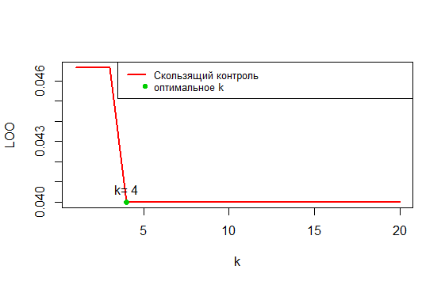

#### Карта	классификации	kwNN , k = 4

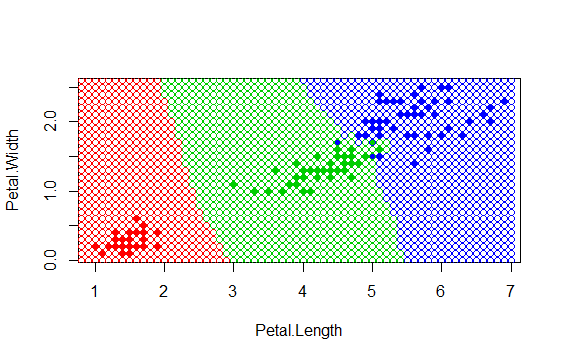
---

#### Сравнение	качества	алгоритмов	kNN и	kwNN.

kNN — один из простейших алгоритмов классификации, поэтому на реальных задачах он зачастую оказывается неэффективным. Помимо точности классификации, проблемой этого классификатора является скорость классификации. 

kwNN отличается от kNN, тем что учитывает порядок соседей классифицируемого объекта, улчшая качество классификации.

#### Пример,	показывающий	преимущество	метода kwNN над kNN.
	
Недостаток kNN в том, что максимальная сумма голосов может достигаться на нескольких классах одновременно.
В задачах с двумя классами этого можно избежать, если брать только нечётные значения k. Более общая тактика, которая годится и для случая многих классов — ввести строго убывающую последовательность вещественных весов, задающих вклад i-го соседа в классификацию.


### 2.5. PW(Парзеновские окна) <a name="aPw"></a>
Для оценки близости объекта _u_ к классу _y_ алгоритм использует следующую
функцию:


, где 
 — функция ядра.

Парзеновская оценка плотности имеет вид:

=arg\max_{y\epsilon&space;Y}\lambda&space;_{y}\sum_{i:y_{i}=y}&space;K(\frac{\rho(x,x_{i})}{h}))


Алгоритм для классифицируемой точки _u_ строит
окружность, радиусом _h_. Все точки, не попавшие в эту окружность,
отсеиваются (кроме гауссовского). Для остальных, вычисляется вес,
суммируется, и класс с наибольшим весом считается победителем.

Программная реализация алгоритма:
```
PW = function(distances, u, h) {
    weights = PW.kernel(distances / h)
    classes = unique(names(distances))

    weightsByClass = sapply(classes, function(class, arr) { sum(arr[names(arr) == class]) } , weights)

    if (max(weightsByClass) == 0) return("") #ни одна точка не попала в окно

    return(names(which.max(weightsByClass)))
}
```
где `distances` – расстояние от точки `u` до всех точек выборки,
`names(distances)` – наименование классов точек выборки.

Параметр ширины `h` раасчитывается с помощью `Loo`    :
```
LOOPW = function(points, classes, hValues) {
  n = dim(points)[1]
  loo = rep(0, length(hValues))
  
  for (i in 1:n) {
    u = points[i,]
    sample = points[-i,]
    distances = distances(sample, u)
    names(distances) = classes[-i]
    
    for (j in 1:length(hValues)) {
      h = hValues[j]
      classified = PW(distances, u, h)
      loo[j] = loo[j] + (classified != classes[i])
    }
  }
  
  loo = loo / n
}
```
`h = hValues[which.min(loo)]` 


Чаще всего применяются 5 типов ядер:
- Прямоугольное 
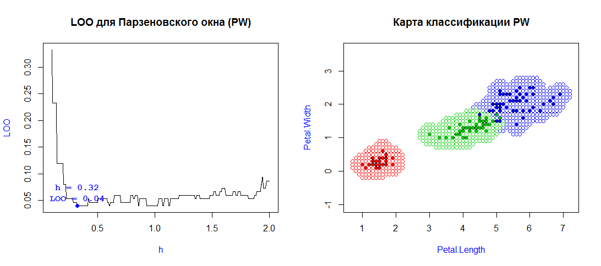
- Треугольное 
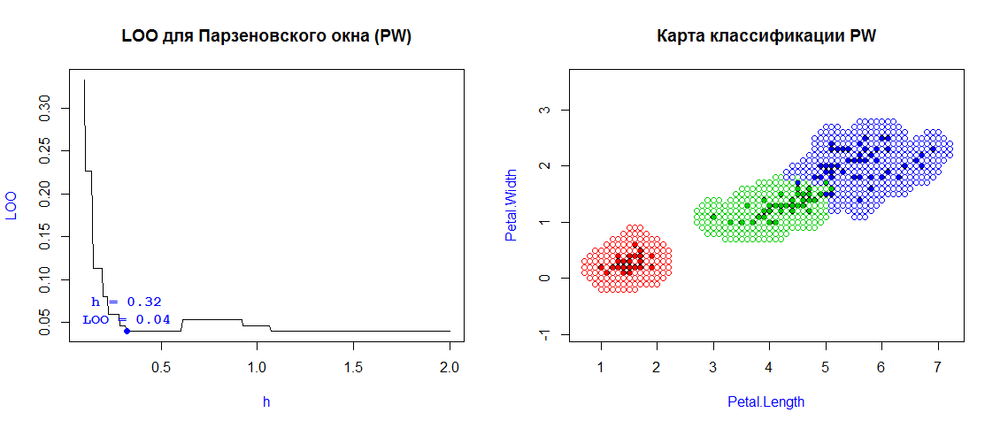
- Квартическое 
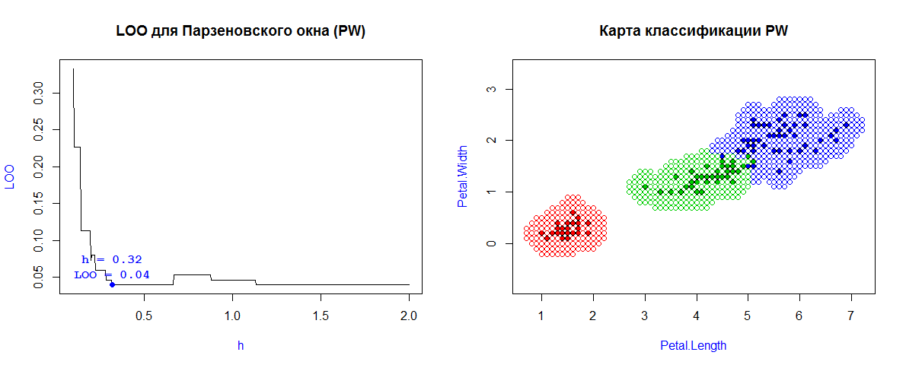
- Епанечниково 

- Гауссовское (нормальное распределение)


### 2.5. Потенциальные функции <a name="aPF"></a>

Для оценки близости объекта _u_ к классу _y_ алгоритм использует следующую
функцию:


, где 
 — функция ядра.

Алгоритм для каждого обучающего объекта _x_ строит
окружность, радиуса _h_ и силы воздействия (потенциала)
.

Программная реализация функции классификации:
```
PF = function(distances, potentials, h) {
    weights = potentials * PF.kernel(distances / h)
    classes = unique(names(distances))

    weightsByClass = sapply(classes, sumByClass, weights)

    if (max(weightsByClass) == 0) return("") #ни одна точка не попала в окно

    return(names(which.max(weightsByClass)))
}
```
Однако, прежде, чем использовать потенциалы, их необходимо подобрать. 
Изачально потенциалы заполняются нулями. Далее, пока количество ошибок классификации
не достигнет нужного предела, выбираем случайно точку _x_ из выборки. Если для нее
классификация выполняется неверно, увеличиваем потенциал на 1 и пересчитываем
общее количество ошибок.

Ядро квартическое , _h_ для красных 1 , для остальных 0.25
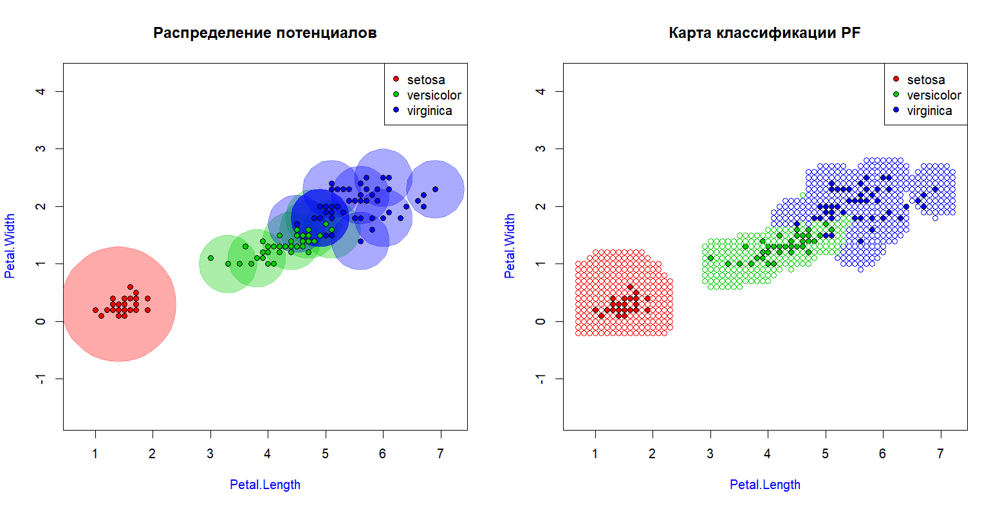


Ядро  <a href="img/Rplot.png">гаусовское</a>   

### 2.6. STOLP <a name="aStolp"></a>


## 3.Байесовские классификаторы <a name="aBaes"></a>

Байесовский подход к классификации основан на теореме, утверждающей,
что если плотности распределения каждого из классов известны,
то искомый алгоритм можно выписать в явном виде.
Более того, этот алгоритм оптимален,
то есть обладает минимальной вероятностью ошибок.

Для классифицируемого объекта вычисляются функции правдоподобия каждого
из классов, по ним вычисляются апостериорные вероятности классов.
Объект относится к тому классу, для которого __апостериорная вероятность
максимальна__.


На практике _плотности распределения классов_, как правило, не известны.
Их приходится оценивать (восстанавливать) по обучающей выборке.
В результате байесовский алгоритм перестаёт быть оптимальным,
так как восстановить плотность по выборке можно только с некоторой погрешностью.

__Разделяющая поверхность__ между классами _t_ и _s_ – это геометрическое
место точек

таких, что _максимум апостериорной вероятности_ достигается одновременно
при _y = s_ и _y = t_.

.

Следующие алгоритмы по исходным выборкам восстанавливают _плотности распределения
классов_ и отдеяют классы друг от друга при помощи
_разделяющей поверхности_.

### Нормальный дискриминантный анализ <a name="aNormal"></a>

Это специальный случай баесовской классификации, когда предполагается, что плотности
всех классов

являются многомерными нормальными. В этом случае задача решается аналитически.
Сами плотности вычисляются по формуле:

,
в которой


– объект, состоящий из *n* признаков,


– математическое ожидание,


– ковариационная матрица (положительно определенная, симметричная, невырожденная).

#### Геометрия нормальной плотности

1. Если признаки некореллированы, то есть

, то плотности распределения имеют форму эллипсоидов, параллельных осям координат:

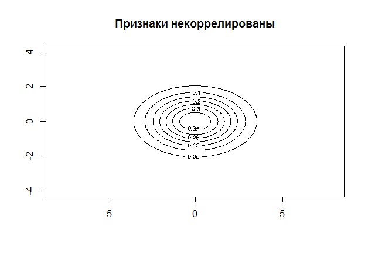

Матрица ковариации : 
```
c(3,0,

 0,1)
 ```
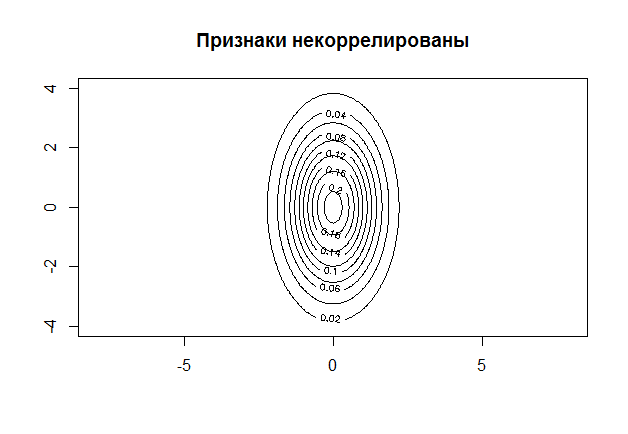

Матрица ковариации : 
```
c(1,0,

  0,3)
```

2. Если признаки имеют одинаковые дисперсии
,
линии уровня имеют форму эллипсоидов:

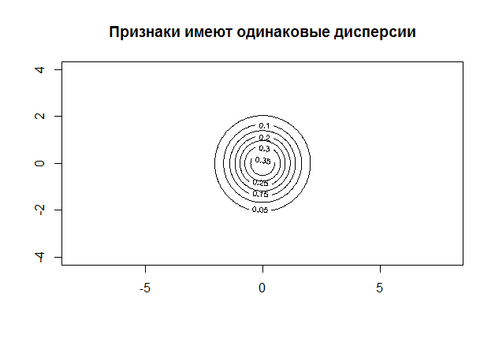

Матрица ковариации :
```
c(1,0,

  0,1)
```
3. Если матрица не диагональна, то линии уровня – эллипсоиды, повернутые относительно
оси координат:

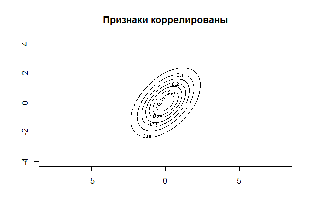

Матрица ковариации : 
```
c(1,1,

  0,1)
```
### Наивный баесовский алгоритм <a name="aNNBaes"></a>

<p>Если признаки элементов независимые случайные величины, то функции правдоподобия классов примут вид</p>
  <p>p<sub>y</sub>(x) = p<sub>y1</sub>(ξ<sub>1</sub>)⋅⋅⋅p<sub>yn</sub>(ξ<sub>n</sub>)</p>
  <p>где p<sub>yj</sub>(ξ<sub>j</sub>) плотность распределения значений j-го признака для класса y.</p>
  <p>Подставив в байесовское решающее правило эмпирические оценки одномерных плотностей признаков получим алгоритм</p>
  <p>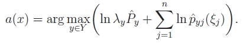</p>
  

  <p>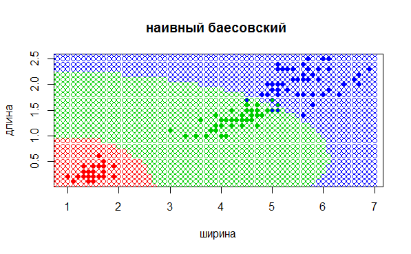</p>

### Подстановочный алгоритм (Plug-in) <a name="aPlug"></a>

__Подстановочный алгоритм__ относится к нормальному дискриминантному анализу.

Чтобы узнать _плотности распределения классов_, алогритм восстанавливает
неизвестные параметры

по следующим формулам для каждого класса _y_ :


```
estimateMu = function(points) {
    rows = dim(points)[1]
    cols = dim(points)[2]
    mu = matrix(NA, 1, cols)
    for (col in 1:cols) {
        mu[1, col] = mean(points[, col])
    }
    return(mu)
}
```

.

```
estimateCovarianceMatrix = function(points, mu) {
    rows = dim(points)[1]
    cols = dim(points)[2]
    covar = matrix(0, cols, cols)
    for (i in 1:rows) {
        covar = covar + (t(points[i,] - mu) %*% (points[i,] - mu)) / (rows - 1)
    }
    return(covar)
}
```

Программа доступна по ссылке:
[shinyapps.io](https://mikel4u4u.shinyapps.io/Desktop/).

Алгоритм довольно точно восстанавливает _ковариационную матрицу_ и
_мат. ожидание_ объектов выборки.

_Разделяющая кривая  парабола_
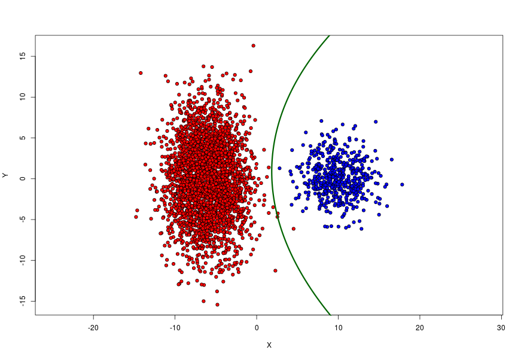

Однако при малом количестве количестве объектов, точность падает:

_Разделяющая кривая  элипс_
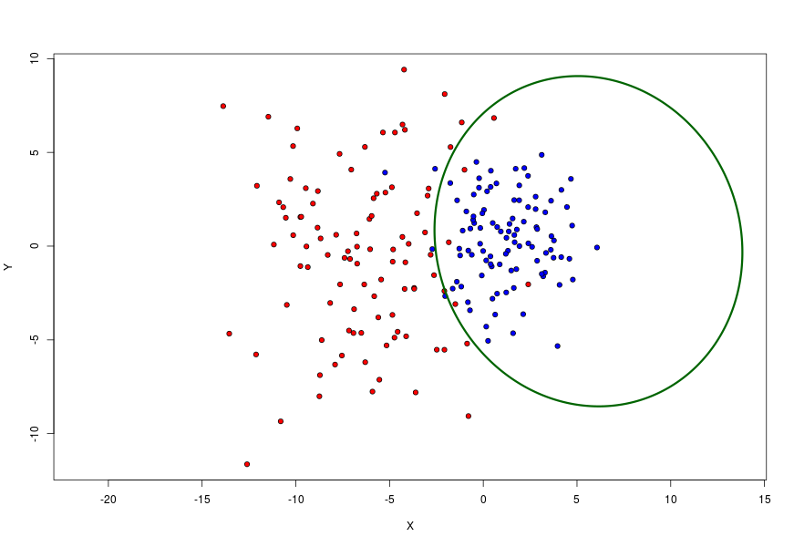


_Разделяющая кривая  гипербола_
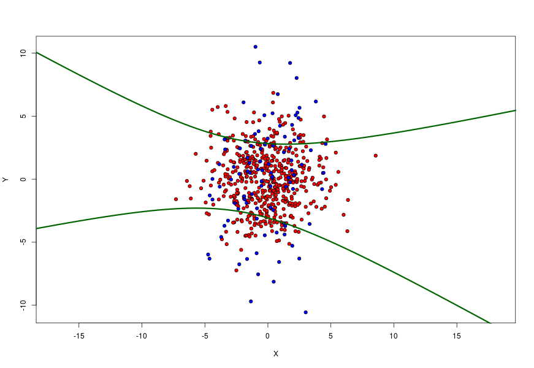

## 4.Линейные классификаторы <a name="aLinear"></a>
Пусть 
и .
Алгоритм


является __линейным алгоритмом классификации__.
Если _f_>0, то алгоритм _a_ относит _x_ к классу +1. Иначе к классу -1.

Отсюда

называется __уравнением разделяющей поверхности__.

Параметр  иногда опускают. Однако в таком
случае разделяющая поверхность (в нашем случае с 2мя признаками – прямая),
соответствующая уравнению
,
будет всегда проходить через начало координат. Чтобы избежать такого обобщения,
будем полагать, что среди признаков _x_ есть константа
,
тогда роль свобоного коэффициента 
играет параметр .
Тогда разделяющая поверхность имеет вид
.

Величина

называется __отступом__ объекта относительно алгоритма классификации. Если
,
алгоритм совершает на объекте

ошибку.


– монотонно невозрастающая __функция потерь__, мажорирует пороговую функцию
.
Тогда __минимизацю суммарных потерь__ можно рассматривать как функцию вида


#### Метод стохастического градиента

Для минимизации

применяется __метод градиентного спуска__.

В начале выбирается некоторое _начальное приближение вектора весов_ _w_.
Не существует единого способа инициализации весов. Хорошей практикой считается
инициализировать веса случайными малыми значениями:

, где _n_ – количество признаков _x_.

Далее высчитывается _текущая оценка функционала_


Затем запускается итерационный процесс, на каждом шаге которого вектор _w_
изменяется в сторону наиболее быстрого убывания _Q_. Это направление противоположно
вектору градиента
. Соответственно веса меняются по
правилу:


или

,

где

– __темп обучения__. Чтобы не проскочить локальный минимум темп обучания принято
полагать небольшим. Однако, при слишком маленьком его значении алгоритм будет
медленно сходится. Хорошей практикой считается его постепенное уменьшение по ходу
итераций. Мы же будем полагать его равным
.

__Критерий останова__ основан на приблизительной оценке _Q_ методом
_экспоненциальной скользящей средней_:


,

где

– __ошибка__ алгоритма на случайном элементе
,

 – __параметр сглаживания__,
полагаем его равным
.

Алгоритм может остановиться в двух случаях:

1. Он не допускает ошибки ни на каком элементе;
2. Значение _Q_ стабилизировано, то есть
.
``` 
if (abs(Qprev - Q) / abs(max(Qprev, Q)) < 1e-5)
```

<u>Примечание.</u> Градиентный метод чувствителен к масштабу измерения признаков.
Если норма _x_ большая, итерационный процесс может оказаться парализованным.
Чтобы этого не произошло, рекомендуется _нормализовать_ признаки:


, где

– _j_-й признак.

Рассмотрим пример стохастического градиента для ADALINE

```
sg.ADALINE <- function(xl, eta = 1, lambda = 1/6)
{
  l <- dim(xl)[1]
  n <- dim(xl)[2] - 1
  w <- c(1/2, 1/2, 1/2)
  iterCount <- 0
  # начальное Q
  Q <- 0
  for (i in 1:l)
  {
    ## считаем скалярное произведение <w,x>
    wx <- sum(w * xl[i, 1:n])
    ## считаем отступ 
    margin <- wx * xl[i, n + 1]
    Q <- Q + lossQuad(margin)
  }
  repeat
  {
    
    margins <- array(dim = l)
    
    for (i in 1:l)
    {
      xi <- xl[i, 1:n]
      yi <- xl[i, n + 1]
      margins[i] <- crossprod(w, xi) * yi
    }
    # выбрать объекты с ошибкой
    errorIndexes <- which(margins <= 0)
    if (length(errorIndexes) > 0)
    {
      # выбрать случайный индекс из  ошибок
      i <- sample(errorIndexes, 1)
      iterCount <- iterCount + 1
      xi <- xl[i, 1:n]
      yi <- xl[i, n + 1]
      wx <- sum(w * xi)
      margin <- wx * yi
      # высчитываем ошибку
      ex <- lossQuad(margin)
      eta <- 1 / sqrt(sum(xi * xi))
      w <- w - eta * (wx - yi) * xi
      # Расчитываем новое  Q
      Qprev <- Q
      Q <- (1 - lambda) * Q + lambda * ex
      # выходим, если Q стабилизировалось
      if (abs(Q.prev - Q) / abs(max(Q.prev, Q)) < 1e-5) break
    }
     #выходим, если выборки полностью разделены
    else
    {
      break
    }
  }
  return (w)
}
```

Следующие алгоритмы за основу берут _стохастический градиент_, меняя только
функцию потерь

и правило обновления весов.

#### Адаптивный линейный элемент (adaline)

Имеет _квадратичную функцию потерь_

и _дельта-правило_ правило обновления весов  
.


#### Персептрон Розенблатта

Имеет _кусочно-линейную функцию потерь_

и _правило Хебба_ для обновления весов
.

#### Логистическая регрессия

Также является __оптимальный байесовским классификатором__ из-за своих довольно
сильных вероятностных предположений.

Имеет _логистическую функцию потерь_

и _логистическое_ правило обновления весов

, где

– _сигмоидная функция_.

#### Вывод по линейным классификаторам


Рассмотрим примеры работы классификаторов

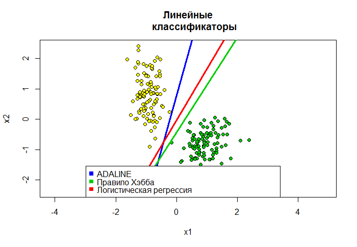


| Метод         | Параметра          | Количество ошибок (Loo) |
| ------------- |:------------------:| -----:|
|  <a href="src/2w.R">kNN</a>     | k = 4 , l = 150 |  0.04 |
|  <a href="src/Kwnn.r">Kwnn</a>  | k = 4 , l = 150 |  0.04 |
| Парзеновские окна|
| Ядро         | Параметры         | Количество ошибок (Loo) |
|  Прямоугольное      | h = 0.32 |  0.04 |
|  Треугольное   |  h = 0.32 |  0.04 |
|  Квартическое    |  h = 0.32 |  0.04 |
|  Епанечниково    |  h = 0.32 |  0.04 |
|  Гауссовское    |  h = 0.1 |  0.04 |


